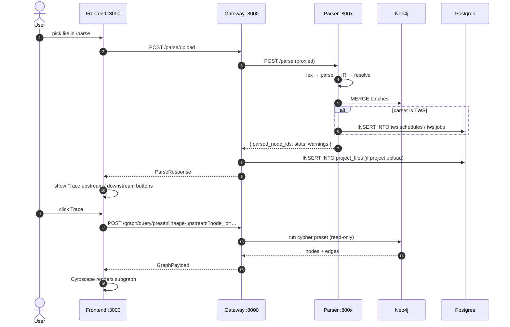

# Data flow

What happens between a file upload and a rendered lineage graph.

## Why proxy through the gateway

- **Single host:port for the frontend** — the four parser ports are an
  implementation detail; the frontend always talks to `:8000`.
- **CORS + auth in one place** — only the gateway exposes
  `CORS_ALLOWED_ORIGINS`; parsers stay internal to the docker network.
- **Read-only Cypher guard** — the gateway's `/graph/query/cypher` runs
  user-supplied Cypher through `cypher_guard.assert_read_only` before
  forwarding to Neo4j, so the public-facing surface can never mutate
  the graph.
- **File provenance** — `/parse/upload` saves to a shared `uploads/`
  volume (mounted into both gateway and parser containers) so the parser
  opens the same path the gateway wrote.

## See also

- [System architecture](/architecture/system).
- [Frontend lineage trace](/frontend/lineage-trace).
