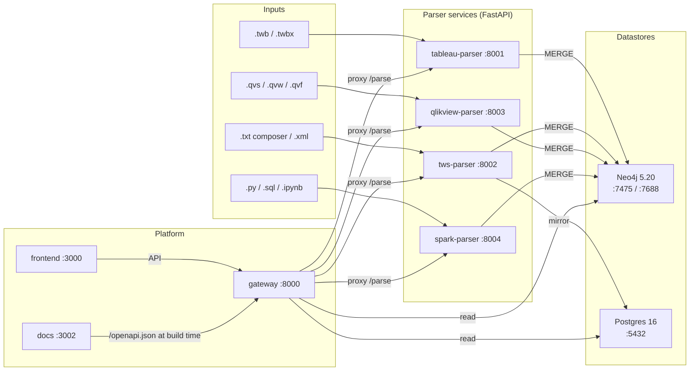

# System architecture

Eight services, three datastores, one knowledge graph.

## Services in detail

| Service | Image / build | Port | Purpose |
|---|---|---|---|
| **neo4j** | `neo4j:5.20-community` + APOC | 7475 (HTTP), 7688 (Bolt) | Knowledge graph store. Auth `neo4j` / `lineagepass`. |
| **postgres** | `postgres:16-alpine` | 5432 | TWS mirror tables (`tws.schedules`, `tws.jobs`) + `projects` metadata. |
| **tableau-parser** | `tableau-parser/Dockerfile` (Python) | 8001 | Parses `.twb` / `.twbx`. |
| **tws-parser** | `tws-parser/Dockerfile` (Python + ANTLR codegen) | 8002 | Parses TWS composer DSL + XML exports. Dual-writes to Postgres. |
| **qlikview-parser** | `qlikview-parser/Dockerfile` (Python + ANTLR codegen) | 8003 | Parses `.qvs` / `.qvw` / `.qvf`. |
| **spark-parser** | `spark-parser/Dockerfile` (Python) | 8004 | Parses `.py` / `.sql` / `.ipynb` via AST + sqlglot. |
| **gateway** | `apps/gateway/Dockerfile` (FastAPI) | 8000 | Federates `/parse`, hosts Cypher presets, owns projects. |
| **frontend** | `apps/frontend/Dockerfile` (Next.js + Carbon) | 3000 | Carbon Design System UI with Cytoscape.js graph viz. |
| **docs** | `apps/docs/Dockerfile` (Docusaurus 3 → nginx) | 3002 | This site. |

## Service discovery

All inter-service communication happens over the `lineage-platform_default`
docker network using the compose service names as DNS — `gateway`,
`tableau-parser`, etc. The gateway resolves each parser by its
`PARSER_<NAME>_URL` env var (default: `http://<service>-parser:8000`).

## See also

- [Data flow](/architecture/data-flow) — what happens when a file is uploaded.
- [Storage](/architecture/storage) — what each datastore is responsible for.
- [Determinism](/architecture/determinism) — the SHA-256 id contract.
