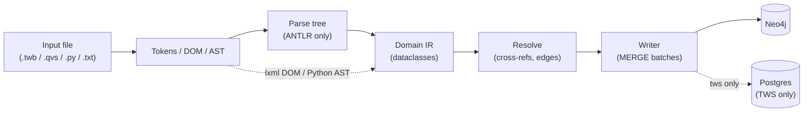

# Pipeline architecture

Every parser follows the same six-stage shape, even when the front-end
technology differs (ANTLR for TWS / QlikView, lxml for Tableau, Python
AST + sqlglot for Spark).

## Why the shape is the same

The platform's value comes from **cross-parser convergence** — a `:Table`
read by Spark and exposed by Tableau is one node, not two. That requires
every parser to commit to the same identity contract before it writes.
The shared discipline:

| Discipline | Where it lives | Result |
|---|---|---|
| Deterministic ids (SHA-256 of a canonical string) | each parser's `utils/ids.py` | Same input → same node id, every run, every parser. |
| Strict label allow-list | `lineage-contracts/schema/neo4j-constraints.cypher` | No label sprawl; queries stay tractable. |
| MERGE-only writes | each parser's `graph/writer.py` | Re-parsing is idempotent. Constraints catch divergence. |
| Per-node `source_files` provenance | every writer | One graph node can know which file(s) contributed to it. |

## Where each parser plugs in

| Parser | Front-end | Hard part |
|---|---|---|
| Tableau | lxml DOM walk | Custom-SQL CTE column lineage (sqlglot). |
| TWS | ANTLR4 | FOLLOWS scope resolution + RRULE/`MONTHSTART`/`WORKDAYS` normalisation. |
| QlikView | ANTLR4 + script preprocessor | `$(var)` expansion, `$Syn` synthetic-key inference. |
| Spark | Python AST + sqlglot | DataFrame chain resolution across re-assignments + `.join()`/`.withColumn()` chains. |

## See also

- [Cross-parser convergence](/parsers/convergence).
- [Determinism](/architecture/determinism).
