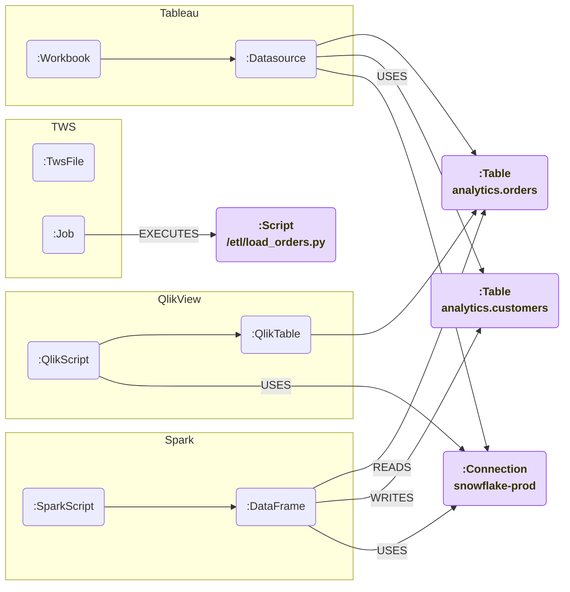

# Cross-parser convergence

Each parser writes into its own corner of the graph **plus** a small set
of **shared labels** — `:Table`, `:Connection`, `:Script`, `:Attribute`.
When two parsers compute the same SHA-256 id for one of those nodes,
they MERGE onto the same node and lineage collapses across systems.

The four nodes in purple are the **shared labels** — same id across
parsers, MERGE'd once.

## What makes the ids collide

All shared labels derive their id from a canonical string per
[`lineage-contracts/schema/node-id-rules.md`](/architecture/contracts):

| Label | Canonical string | Where computed |
|---|---|---|
| `:Table` | `table::<fully_qualified_name>` (lowercased, trimmed) | every parser's `utils/ids.py` |
| `:Connection` | `connection::<class>::<server>::<dbname>` | every parser |
| `:Script` | `script::<absolute_path>` | TWS + Spark today; Ab Initio / BTEQ in future |
| `:Attribute` | `attribute::<table_id>::<column>` | every parser that touches columns |

So as long as parsers agree on the canonical-string spelling, ids
collide and Neo4j MERGE de-duplicates.

## Why this matters

- **Impact analysis**: "this Tableau dashboard is broken — what
  upstream Spark notebooks fed it?" Trace upstream through `:Datasource`
  → `:Table` → (READS_TABLE) → `:DataFrame` → `:SparkScript`.
- **Operational visibility**: "this TWS schedule failed — what
  downstream analytics consumes its output?" Trace from `:Job` →
  `:Script` → tables it writes → Tableau dashboards.

## See also

- [Contracts](/architecture/contracts) — the full ID rules.
- [Determinism](/architecture/determinism) — why the same input always produces the same id.
