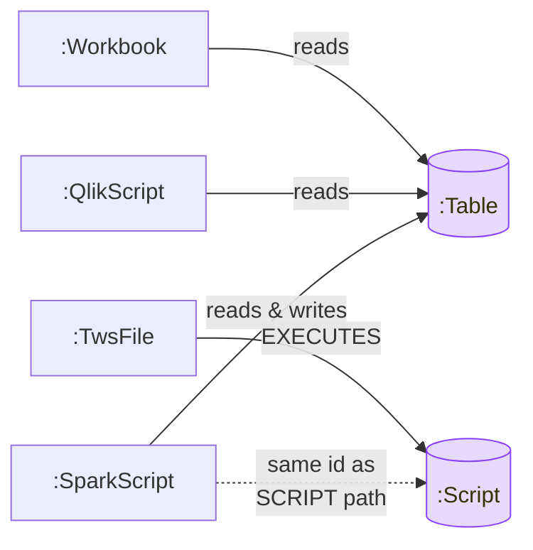

# Parsers overview

Four parsers, one knowledge graph. Each runs as an independent FastAPI
service, writes via Neo4j MERGE, and collapses onto shared `:Table` /
`:Connection` / `:Script` nodes.

## Capability matrix

| | [Tableau](/parsers/tableau) | [TWS](/parsers/tws) | [QlikView](/parsers/qlikview) | [Spark](/parsers/spark) |
|---|---|---|---|---|
| **Input formats** | `.twb`, `.twbx` | `.txt` (Composer DSL), `.xml` | `.qvs`, `.qvw`, `.qvf` | `.py`, `.sql`, `.ipynb` |
| **Front-end** | lxml DOM | ANTLR4 | ANTLR4 + script preprocessor | Python AST + sqlglot |
| **Generated code** | — | `src/tws_parser/generated/` | `src/qlikview_parser/generated/` | — |
| **Container port** | 8001 | 8002 | 8003 | 8004 |
| **Top-level wrapper** | `:Workbook` | `:TwsFile` | `:QlikScript` | `:SparkScript` |
| **Postgres mirror** | — | `tws.schedules`, `tws.jobs` | — | — |
| **Shared labels emitted** | `:Table`, `:Connection`, `:Attribute` | `:Script` | `:Table`, `:Connection`, `:Attribute` | `:Table`, `:Connection`, `:Attribute`, `:Script` |
| **Embedded SQL lineage** | sqlglot (calculated fields, custom SQL) | — | sqlglot (`SQL SELECT`) | sqlglot (`spark.sql(…)`) |
| **Secret scrubbing** | — | — | `secrets.py` (PWD=, AWS, bearer) | — |

## How they relate

The purple nodes are the cross-parser collision points — see
[Cross-parser convergence](/parsers/convergence) for the full story.

## Pick a parser to dive into

- [Tableau parser](/parsers/tableau)
- [TWS parser](/parsers/tws)
- [QlikView parser](/parsers/qlikview)
- [Spark parser](/parsers/spark)
- [Pipeline architecture](/parsers/architecture) — what they all share.
