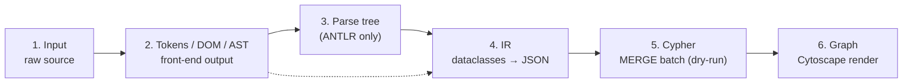

# See the parser work

Each parser page embeds a **simulator widget** — six tabs that walk
through a real fixture's parsing pipeline, stage by stage. Below is a
guided narrative of what to look for as you click through the tabs.



## What each tab tells you

1. **Input** — the verbatim source. Read it the way the parser does
   before any transformation.
2. **Tokens / DOM / AST** — the front-end's output. For ANTLR parsers
   (TWS, QlikView) you see the lexer's token stream as
   `(line, col, type, text)`. For Tableau you see an elided lxml DOM
   tree. For Spark you see the Python `ast.dump` summary.
3. **Parse tree** — ANTLR-only. The rule names and terminal positions
   the visitor will walk.
4. **IR** — the typed dataclasses (`WorkbookIR`, `JobStreamIR`,
   `QlikViewApp`, `SparkScriptIR`) serialized with
   `dataclasses.asdict`. This is the API contract every downstream
   consumer (writer, resolver, tests) reads.
5. **Cypher (dry-run)** — representative MERGE statements the writer
   would execute against Neo4j, with example row payloads. The real
   writer uses `_batched()` to chunk these; the dry-run shows you the
   templates.
6. **Graph** — the live Cytoscape rendering of `{nodes, edges}` the
   writer would produce. Drag, zoom, hover.

## Pick a simulator to start

- [TWS — single schedule, single job](/parsers/tws#simulator--single-schedule-single-job).
- [TWS — realistic dump (3 schedules, 10 jobs)](/parsers/tws#simulator--realistic-dump-with-three-schedules).
- [Tableau — simple single datasource](/parsers/tableau#simulator--simple-single-datasource).
- [Tableau — calculated fields](/parsers/tableau#simulator--calculated-fields).
- [QlikView — simple SQL load](/parsers/qlikview#simulator--simple-sql-load).
- [QlikView — left join](/parsers/qlikview#simulator--left-join).
- [Spark — simple read/write](/parsers/spark#simulator--simple-read--write).
- [Spark — join and select](/parsers/spark#simulator--join-and-select).

## Refreshing the snapshots

Snapshots live under `apps/docs/static/simulations/<parser>/<fixture>/`
and are checked into git so the docs Docker build works offline. To
regenerate after a parser change:

```bash
cd lineage-platform
docker compose up -d tableau-parser tws-parser qlikview-parser spark-parser
cd apps/docs
npm run build:simulations
```

Then commit the updated snapshot files.
