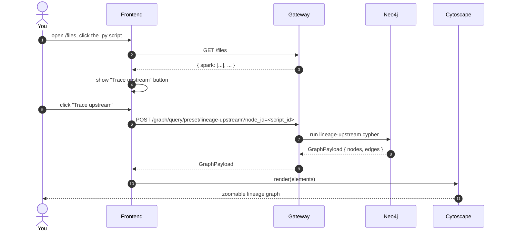

# Trace Spark lineage

You have a Spark script that writes to a table. You want to walk back
through every transformation, every source table, and every shared
column that fed the write. Here's the end-to-end click path.

## What the preset does

`lineage-upstream.cypher` walks **outgoing** edges from the start node,
following everything that produces upstream context:

- `CONTAINS_*` (file → child entities)
- `READS_TABLE`, `WRITES_TABLE` (with direction inverted on upstream)
- `DERIVES_FROM_DATAFRAME`, `DERIVES_FROM`
- `EXECUTES` (job → script)
- `HAS_COLUMN`, `HAS_ATTRIBUTE`

See the rendered cypher at [reference/presets/lineage-upstream](/reference/presets/lineage-upstream).

## Try it yourself

1. **Upload a fixture.** `POST /parse/upload` with `source_type=spark`
   and one of the canonical fixtures under
   `spark-parser/fixtures/pyspark/`.
2. **Find the SparkScript id** in `GET /files` (look under the `spark`
   key) — it's the value of `id`.
3. **Trace.** `POST /graph/query/preset/lineage-upstream?node_id=<id>`
   with an empty JSON body. You'll get `{nodes: [...], edges: [...]}`
   ready for Cytoscape.

## See also

- [Cypher preset · lineage-upstream](/reference/presets/lineage-upstream).
- [Frontend lineage trace](/frontend/lineage-trace).
- [See the parser work](/tutorials/see-the-parser-work) — walk Spark's stages with the simulator.
